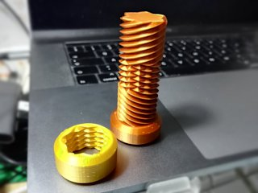
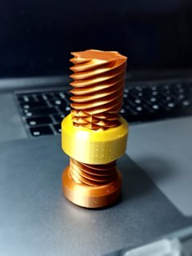

# Reversing thread bolt for two-way nut
*3D printable bolt with screw thread that reverses direction*

### License
[Creative Commons - Attribution - Non Commercial - Share Alike](https://creativecommons.org/licenses/by-nc-sa/4.0/)

### Attribution
This is a remix of gvera's Two way screw ([Thingiverse thing:4690959](https://www.thingiverse.com/thing:4690959)) and yotka's Two Way Nut for the Two Way Screw ([https://www.thingiverse.com/thing:4704961](https://www.thingiverse.com/thing:4704961)). Original concept of the two-way bolt and nut comes from videos by Олег Певцов: <https://www.youtube.com/watch?v=cDfMI5ahbJI> and <https://www.youtube.com/watch?v=h8sRZJbIHlY>.

### Gallery

[🔎](images/reversebolt1.jpg) [🔎](images/reversebolt2.jpg)

## Description and Instructions

This is a bolt with sections of both regular right-hand and left-hand threads, joined by a section of two-way thread. Only the two-way nut can run across the entire length of the bolt, by reversing its rotation half way.

I included slightly modified versions of all the nuts, with little triangles indicating the thread direction. (Of course the left-threaded nut cannot be screwed on the bolt with end cap.)

I made this in Blender by generating the two regular threads with the same profile as the thread used in gvera's original model, and then semi-manually stitching them to the two-way thread. This was a bit of a chore but still much easier than trying to do a Boolean intersection of the two threads, given how finicky Blender's Boolean operator still is despite recent improvements.

### Print settings

This will probably work fine at 0.2 mm layers but like the original, 0.15 mm will be smoother. I printed these at 80% size without problems. Adequate cooling is recommended to prevent the sharp points from curling up.

If you print the bolt without end cap, you will have to avoid squashing of the first layer. Either level a bit higher than usual, or enable an option like “prevent elephant's foot” in your slicer.

## Tags
`Bidirectional`, `fidget`, `Fidget Toy`, `screw`, `toy`